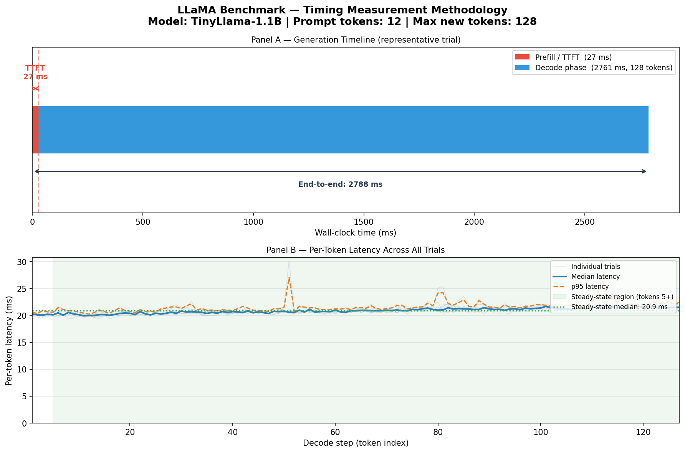
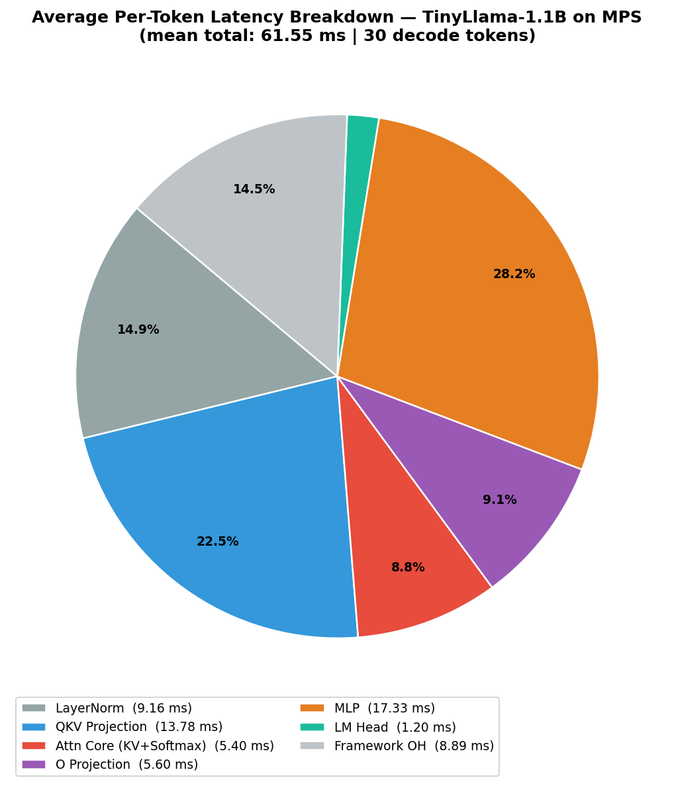
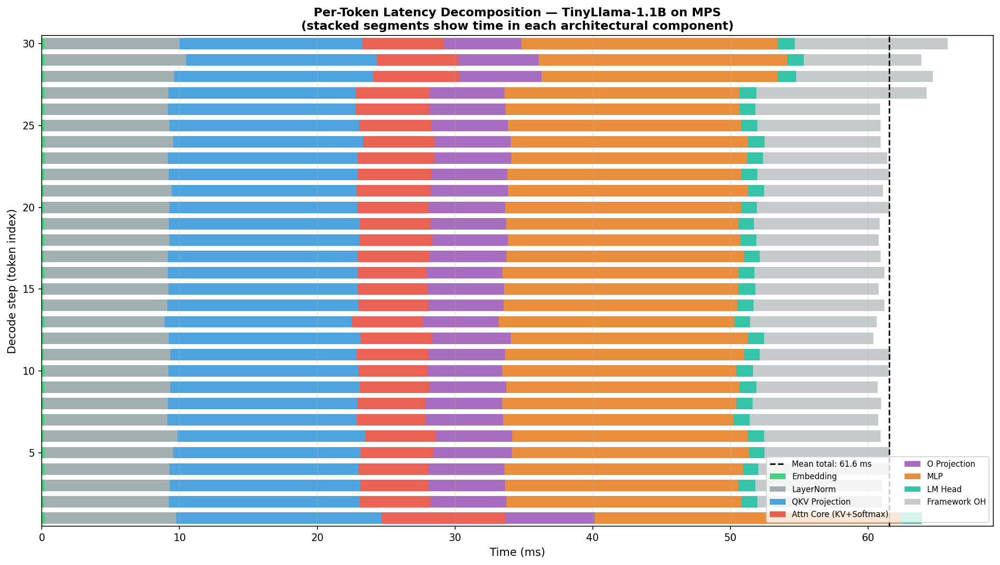
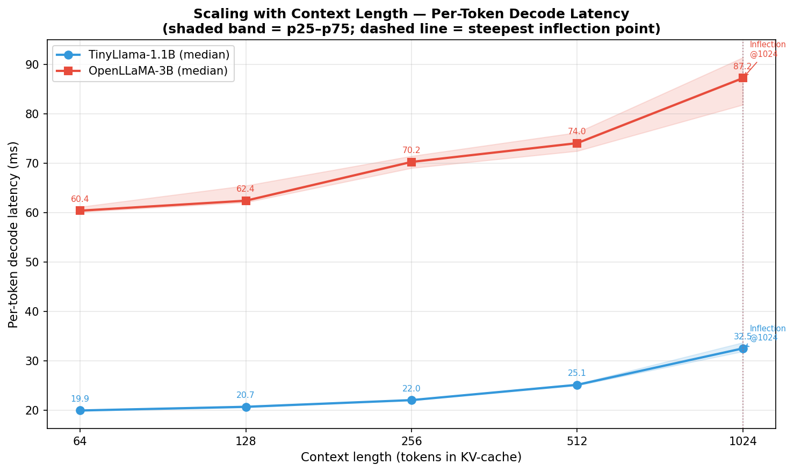
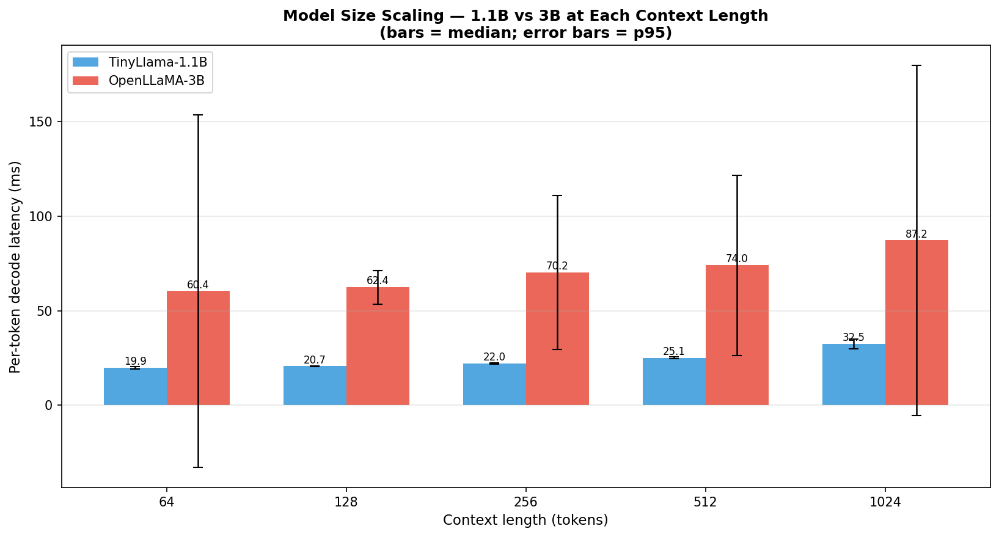
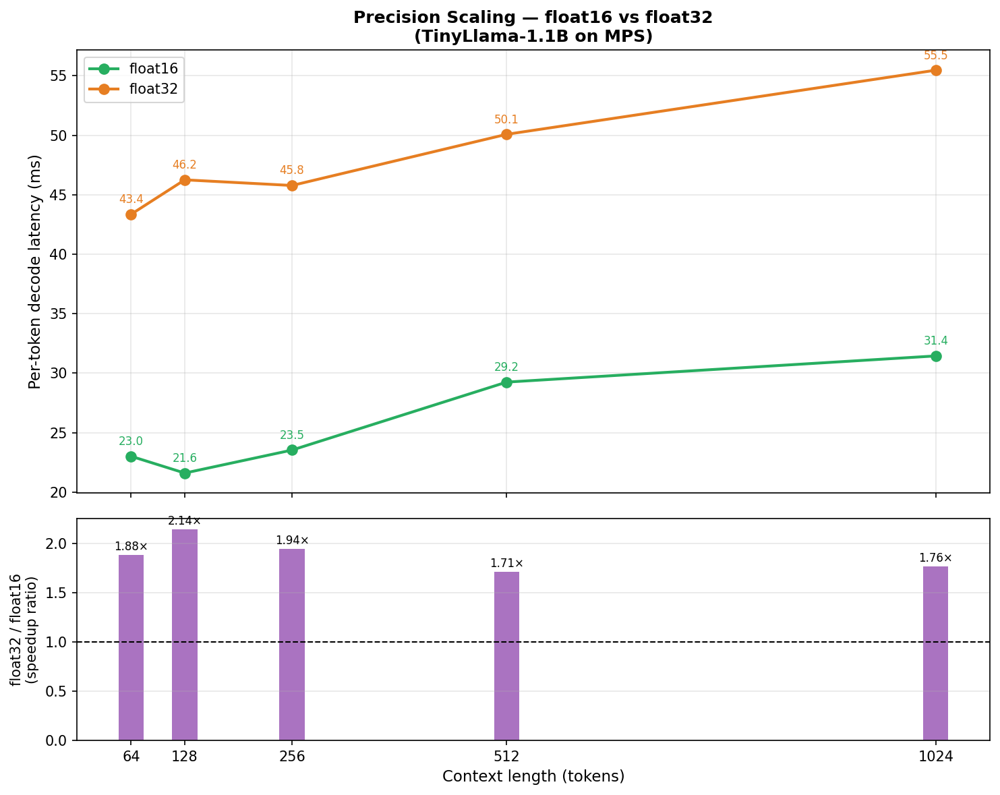

# COA-NOVA: LLM Inference Latency Analysis on Apple Silicon

> A systematic, four-phase study of transformer inference performance on Apple Silicon (MPS),
> spanning benchmark methodology, architectural decomposition, and scaling behaviour across
> context length, model size, and numerical precision.

---

## Table of Contents

1. [Project Overview](#1-project-overview)
2. [System Configuration](#2-system-configuration)
3. [Repository Structure](#3-repository-structure)
4. [Phase 1 — Environment Setup & Basic Inference](#4-phase-1--environment-setup--basic-inference)
5. [Phase 2 — Repeatable Benchmark Harness](#5-phase-2--repeatable-benchmark-harness)
6. [Phase 3 — Latency Decomposition via Forward Hooks](#6-phase-3--latency-decomposition-via-forward-hooks)
7. [Phase 4 — Scaling Analysis](#7-phase-4--scaling-analysis)
8. [Key Findings & Architectural Insights](#8-key-findings--architectural-insights)
9. [Reproducing the Results](#9-reproducing-the-results)

---

## 1. Project Overview

Large Language Models (LLMs) perform autoregressive decoding — generating one token at a time — which makes inference latency a first-class architectural concern. This project investigates **where time goes** during LLM inference and **how latency scales** across three hardware-relevant dimensions:

| Dimension | Values Tested |
|---|---|
| Context length (KV-cache size) | 64 → 128 → 256 → 512 → 1024 tokens |
| Model size | TinyLlama-1.1B vs OpenLLaMA-3B (same LLaMA architecture) |
| Numerical precision | float16 vs float32 |

All experiments run on Apple Silicon via PyTorch's **MPS (Metal Performance Shaders)** backend, which uses a unified memory architecture where CPU and GPU share the same physical DRAM — a setting that makes memory-bandwidth bottlenecks especially visible.

---

## 2. System Configuration

| Component | Detail |
|---|---|
| Hardware | Apple Silicon (unified memory, MPS GPU) |
| Total RAM | 17.2 GB (CPU + GPU shared) |
| Framework | PyTorch + HuggingFace Transformers |
| Python | 3.11 |
| Backend | MPS (Metal Performance Shaders) |

**Models used:**

| Model | Params | Layers | Hidden dim | Heads | FFN dim |
|---|---|---|---|---|---|
| TinyLlama-1.1B-Chat-v1.0 | 1.1 B | 22 | 2048 | 32 | 5632 |
| OpenLLaMA-3B-v2 | 3.4 B | 26 | 3200 | 32 | 8640 |

Both share the same LLaMA decoder-only architecture (RMSNorm, RoPE, Grouped-Query Attention, SwiGLU MLP), isolating the effect of scale rather than architecture.

---

## 3. Repository Structure

```
COA-NOVA/
├── scripts/
│   ├── inference_basic.py          # Phase 1 — basic autoregressive inference
│   ├── benchmark_harness.py        # Phase 2 — repeatable benchmark harness
│   ├── latency_decomposition.py    # Phase 3 — per-component profiling via hooks
│   └── scaling_analysis.py         # Phase 4 — context / model-size / precision sweeps
├── data/
│   ├── benchmark_raw.csv           # Every token latency from every trial (Phase 2)
│   ├── benchmark_summary.csv       # Per-trial aggregates + cross-trial stats (Phase 2)
│   ├── decomposition_per_token.csv # Per-component time for each decode token (Phase 3)
│   ├── decomposition_summary.csv   # Mean / median / stdev per component (Phase 3)
│   ├── scaling_context_length.csv  # Latency vs context length, both models (Phase 4)
│   └── scaling_precision.csv       # Latency vs precision (float16/32) (Phase 4)
├── figures/
│   ├── timing_diagram.png          # TTFT + per-token timeline (Phase 2)
│   ├── decomposition_bar.png       # Stacked per-token component breakdown (Phase 3)
│   ├── decomposition_pie.png       # Average component share pie chart (Phase 3)
│   ├── scaling_context_length.png  # Latency vs context length curves (Phase 4)
│   ├── scaling_model_size.png      # 1.1B vs 3B grouped bar chart (Phase 4)
│   └── scaling_precision.png       # float16 vs float32 + speedup ratio (Phase 4)
└── requirements.txt
```

---

## 4. Phase 1 — Environment Setup & Basic Inference

**Script:** `scripts/inference_basic.py`

Establishes the baseline: load TinyLlama-1.1B onto MPS, run greedy autoregressive decoding for 128 tokens, and record TTFT and per-token latency.

### Concepts introduced

**Autoregressive decoding.** The model runs in a loop: feed the prompt → predict token 1 → append token 1, predict token 2 → … Each step's output is the next step's input. This serial dependency makes parallelism across steps impossible, which is why decoding throughput is memory-bandwidth-bound rather than compute-bound.

**KV-Cache.** At every decode step, the attention mechanism needs the Key and Value tensors for all prior tokens. Without caching, this is O(n²) recomputation. With a KV-cache, each step only computes K/V for the single new token; prior entries are read from cache. The cost becomes: read `2 × L × S × d × bytes_per_element` bytes per step, where L = layers, S = sequence length, d = head dimension — a pure memory-bandwidth operation.

**TTFT (Time to First Token).** The prefill phase processes the entire prompt in one parallel forward pass. This is latency-critical for interactive applications. Subsequent decode steps are faster because they process only one token at a time using the cached K/V.

**MPS synchronization.** MPS dispatches GPU work asynchronously. `torch.mps.synchronize()` is called before and after each timed region to ensure the clock captures actual GPU execution time, not just CPU dispatch time.

---

## 5. Phase 2 — Repeatable Benchmark Harness

**Script:** `scripts/benchmark_harness.py`  
**Outputs:** `data/benchmark_raw.csv`, `data/benchmark_summary.csv`, `figures/timing_diagram.png`

### Methodology

| Step | Detail |
|---|---|
| Warm-up runs | 3 (discarded) — allow Metal shader JIT compilation and OS page-in |
| Timed trials | 10 |
| Outlier filtering | IQR method on per-trial median (removes OS scheduling spikes) |
| Prompt | `"Explain how a computer processor works in simple terms:"` (12 tokens) |
| Max new tokens | 128 |

**Why warm up?** On first execution, PyTorch compiles Metal shaders, allocates memory pools, and the OS brings model weights from SSD into physical RAM. These one-time costs are 5–10× higher than steady-state and would contaminate results if included.

**Why IQR filtering?** Benchmark machines are not bare-metal real-time systems. OS interrupts, thermal throttling events, and background I/O create occasional outlier spikes. The IQR method (flag values outside Q1 − 1.5·IQR … Q3 + 1.5·IQR) is the standard robust approach — it is insensitive to the magnitude of extreme outliers.

### Results

| Metric | Value |
|---|---|
| TTFT (median) | **27.0 ms** |
| Per-token latency (median) | **20.91 ms** |
| Per-token latency (p95) | 21.98 ms |
| Per-token latency (p99) | 22.87 ms |
| Throughput | **~47.8 tokens / sec** |
| Trial-to-trial stdev | 0.77 ms (3.7% CV — highly repeatable) |

The extremely low coefficient of variation (3.7%) confirms that MPS execution is highly deterministic once warm-up is complete, making single-run measurements trustworthy for the scaling study.



---

## 6. Phase 3 — Latency Decomposition via Forward Hooks

**Script:** `scripts/latency_decomposition.py`  
**Outputs:** `data/decomposition_per_token.csv`, `data/decomposition_summary.csv`, `figures/decomposition_bar.png`, `figures/decomposition_pie.png`

### Methodology

PyTorch's `register_forward_pre_hook` / `register_forward_hook` API lets us attach timing callbacks to any `nn.Module` without modifying the model source code. A `TimingHook` calls `torch.mps.synchronize()` immediately before and after each module's forward pass, then records the elapsed wall-clock time.

Hooks are attached to every component across all 22 decoder layers:

| Component | Modules hooked |
|---|---|
| Embedding | `model.embed_tokens` |
| LayerNorm | `input_layernorm`, `post_attention_layernorm` (×22) |
| QKV Projection | `q_proj`, `k_proj`, `v_proj` (×22 each) |
| Attention Core | `self_attn` minus sub-projections (×22) — captures RoPE, KV-cache read/write, softmax |
| O Projection | `o_proj` (×22) |
| MLP | `mlp` (×22) — SwiGLU gate + up + down projections |
| LM Head | `lm_head` |
| Framework OH | Total step time minus all accounted components |

> **Note on absolute vs relative times.** The `synchronize()` calls serialize what would normally be pipelined GPU operations, inflating absolute numbers compared to uninstrumented inference. The **relative breakdown (percentage share)** is accurate and is the primary result of this phase.

### Results — Average per-token breakdown (30 decode steps)

| Component | Mean (ms) | % of Total |
|---|---|---|
| **MLP (SwiGLU FFN)** | **17.33** | **28.2%** |
| QKV Projection | 13.78 | 22.4% |
| Framework Overhead | 8.98 | 14.6% |
| LayerNorm (RMSNorm ×2 per layer) | 9.16 | 14.9% |
| O Projection | 5.60 | 9.1% |
| Attention Core (KV-cache + Softmax) | 5.40 | 8.8% |
| LM Head | 1.20 | 1.9% |
| Embedding | 0.19 | 0.3% |




### Architectural interpretation

**MLP dominates (28.2%).** Each decoder layer contains a SwiGLU feed-forward network with hidden dimension 5632 (2.75× the model dimension). The two large linear projections (up/gate: 2048→5632, down: 5632→2048) account for the largest single share of compute per token.

**QKV projection is the second largest cost (22.4%).** Three linear layers (Q, K, V) map the hidden state to attention heads. With 32 heads and GQA, this is a significant GEMM workload every step.

**Attention core is surprisingly small (8.8%).** At short-to-medium context lengths (< 512 tokens), the softmax and KV-cache read are not the bottleneck — the linear projections dominate. This will invert at very long contexts (see Phase 4).

**LayerNorm is non-trivial (14.9%).** RMSNorm fires twice per layer (pre-attention, pre-MLP) × 22 layers = 44 calls per token. Each is elementwise but the cumulative cost is significant on MPS.

---

## 7. Phase 4 — Scaling Analysis

**Script:** `scripts/scaling_analysis.py`  
**Outputs:** `data/scaling_context_length.csv`, `data/scaling_precision.csv`, `figures/scaling_context_length.png`, `figures/scaling_model_size.png`, `figures/scaling_precision.png`

### 7.1 Methodology — isolating KV-cache read cost

To measure the true cost of attending over a KV-cache of size S, we do **not** simply measure TTFT at different prompt lengths (which conflates prefill compute with cache size). Instead:

1. Prefill with a short fixed prompt (~12 tokens).
2. Autoregressively generate tokens — untimed — until the KV-cache reaches the target length S.
3. Run `MEASURE_STEPS = 15` timed decode steps from that state.

This isolates the per-step cost of **reading a KV-cache of exactly S tokens** — the memory-bandwidth bottleneck that matters for long-context inference.

### 7.2 Context length scaling

| Context (tokens) | TinyLlama-1.1B (ms) | OpenLLaMA-3B (ms) |
|---|---|---|
| 64 | 19.92 | 60.38 |
| 128 | 20.67 | 62.40 |
| 256 | 22.02 | 70.24 |
| 512 | 25.12 | 74.04 |
| **1024** | **32.49** | **87.21** |

**Latency increase from 64→1024 tokens:** +63% for TinyLlama-1.1B, +44% for OpenLLaMA-3B.



**Why does latency grow with context length?**

Each decode step reads the entire KV-cache to compute attention. The memory traffic per step is:

```
Bandwidth = 2 × L × S × d_head × n_heads × bytes_per_element
```

For TinyLlama-1.1B at S = 1024:
```
= 2 × 22 layers × 1024 tokens × 64 head_dim × 32 heads × 2 bytes (float16)
≈ 184 MB per decode step
```

At the MPS memory bandwidth of ~200 GB/s, this alone requires ~0.9 ms — and the growth is **linear in S**, which matches the observed trend. The steeper jump between 512→1024 tokens occurs because the KV-cache no longer fits in L2/shared cache and spills to main DRAM, increasing effective memory latency.

### 7.3 Model size scaling

| Context (tokens) | TinyLlama-1.1B (ms) | OpenLLaMA-3B (ms) | Ratio (3B/1.1B) |
|---|---|---|---|
| 64 | 19.92 | 60.38 | 3.03× |
| 512 | 25.12 | 74.04 | 2.95× |
| 1024 | 32.49 | 87.21 | 2.68× |



OpenLLaMA-3B is consistently ~3× slower than TinyLlama-1.1B despite being only ~3.1× larger in parameters. This near-linear relationship is expected: on a memory-bandwidth-bound workload, runtime scales with the volume of weights and KV-cache data that must be streamed through the memory subsystem each step.

The ratio **narrows at longer contexts** (3.03× → 2.68×) because the KV-cache read cost — which does not scale with model size — becomes a larger fraction of total step time, diluting the model-size effect.

### 7.4 Precision scaling (float16 vs float32)

| Context (tokens) | float16 (ms) | float32 (ms) | Speedup (f32/f16) |
|---|---|---|---|
| 64 | 23.01 | 43.35 | **1.88×** |
| 128 | 21.60 | 46.25 | **2.14×** |
| 256 | 23.54 | 45.77 | **1.94×** |
| 512 | 29.25 | 50.08 | **1.71×** |
| 1024 | 31.45 | 55.47 | **1.76×** |
| **Average** | | | **~1.89×** |



**float16 is ~1.9× faster than float32 across all context lengths.** This aligns precisely with the theoretical expectation: float16 values are 2 bytes vs float32's 4 bytes, so the model weights and KV-cache require half the memory bandwidth. On a bandwidth-bound workload, halving data movement halves runtime. The sub-2× observed speedup (rather than exactly 2×) reflects fixed overheads (framework dispatch, non-memory-bound ops) that do not scale with precision.

---

## 8. Key Findings & Architectural Insights

### Finding 1: LLM decoding is memory-bandwidth-bound, not compute-bound

At each decode step, only one new token is processed — the arithmetic intensity (FLOPs per byte) is extremely low. The GPU spends most of its time streaming weights and KV-cache entries through the memory subsystem, not doing floating-point arithmetic. This is why:
- Precision halving (float16 vs float32) gives a near-2× speedup — memory traffic halves.
- Latency grows linearly with context length — KV-cache read volume grows linearly.
- Throughput scales with model parameter count — more parameters = more bytes streamed.

### Finding 2: MLP feed-forward blocks are the dominant compute cost

The SwiGLU MLP accounts for **28.2%** of per-token latency, followed by QKV projections at **22.4%**. Together the linear layers (MLP + QKV + O-proj) account for **~60%** of total step time. Attention's nonlinear core (softmax, KV-cache scatter/gather) is only **8.8%** at the tested context lengths — linear projections, not attention, are the bottleneck for short-to-medium sequences.

### Finding 3: KV-cache read cost becomes significant at long contexts

Between 64 and 1024 tokens, TinyLlama's per-token latency increases by **12.6 ms (+63%)**. This growth is attributable to the KV-cache read: at 1024 tokens, the KV-cache for TinyLlama-1.1B requires reading ~184 MB per decode step. The jump between 512→1024 tokens is steeper than 256→512, consistent with cache overflow from on-chip to DRAM.

### Finding 4: Benchmark repeatability is high on MPS

Across 10 timed trials with 128 generated tokens each, the coefficient of variation of per-token latency is only **3.7%** (stdev = 0.77 ms). This validates using single-run measurements in the scaling study — MPS execution is deterministic once metal shaders are compiled and memory is warm.

### Summary table

| Metric | Value |
|---|---|
| Baseline per-token latency (TinyLlama-1.1B, float16) | 20.91 ms (~47.8 tok/s) |
| TTFT | 27.0 ms |
| Largest latency component | MLP (28.2%) |
| Latency increase 64→1024 context | +63% (TinyLlama), +44% (OpenLLaMA-3B) |
| float16 speedup over float32 | ~1.89× |
| 3B vs 1.1B overhead | ~3× (matches parameter ratio) |

---

## 9. Reproducing the Results

```bash
# 1. Clone and enter the repo
git clone https://github.com/BrijeshRana1892/COA-NOVA.git
cd COA-NOVA

# 2. Create and activate virtual environment
python3 -m venv venv
source venv/bin/activate

# 3. Install dependencies
pip install -r requirements.txt

# 4. Run phases in order
python scripts/inference_basic.py        # Phase 1 — basic inference (~1 min)
python scripts/benchmark_harness.py      # Phase 2 — benchmark harness (~10 min)
python scripts/latency_decomposition.py  # Phase 3 — hook-based profiling (~5 min)
python scripts/scaling_analysis.py       # Phase 4 — scaling sweeps (~30 min, downloads OpenLLaMA-3B ~6 GB)
```

> **Hardware note:** All experiments require an Apple Silicon Mac with MPS support. On CPU-only machines the scripts will fall back to CPU, but timings will differ significantly. Minimum 16 GB RAM recommended for the 3B model in float16.

**Expected outputs after all phases:**

```
data/
  benchmark_raw.csv
  benchmark_summary.csv
  decomposition_per_token.csv
  decomposition_summary.csv
  scaling_context_length.csv
  scaling_precision.csv

figures/
  timing_diagram.png
  decomposition_bar.png
  decomposition_pie.png
  scaling_context_length.png
  scaling_model_size.png
  scaling_precision.png
```
